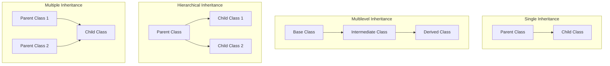
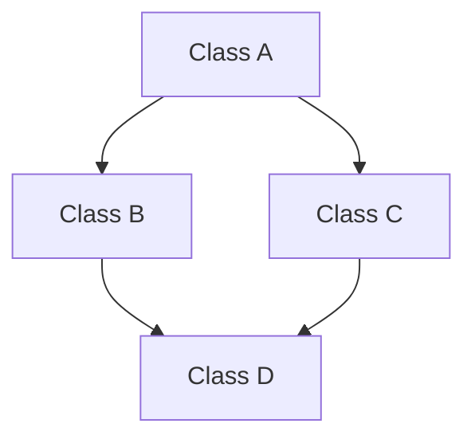

## Access Modifiers

Access modifiers are keywords in object-oriented programming (like Java, C++, C#) that define the visibility/scope of classes, methods, and variables.
They control who can access what in your code.

## Types of Access Modifiers

| Modifier   | Scope / Visibility                                | Example Use Case                          |
|------------|---------------------------------------------------|-------------------------------------------|
| **public** | Accessible from **anywhere** (inside or outside the class, package, project). | Methods like `main()` or utility functions. |
| **protected** | Accessible within the **same package** and by **subclasses** (even in different packages). | Useful for inheritance when child classes need parent’s methods/fields. |
| **default** (no keyword) | Accessible only within the **same package**. | Package-level helper classes. |
| **private** | Accessible only within the **same class**. | Encapsulation: hiding internal details of a class. |

```java
class Example {
    public int publicVar = 10;       // Accessible everywhere
    protected int protectedVar = 20; // Accessible in same package + subclasses
    int defaultVar = 30;             // Accessible only in same package
    private int privateVar = 40;     // Accessible only in this class

    // Public method
    public void showPublic() {
        System.out.println("Public Method");
    }

    // Private method
    private void showPrivate() {
        System.out.println("Private Method");
    }
}

class Test extends Example {
    void display() {
        System.out.println(publicVar);     // ✅ allowed
        System.out.println(protectedVar);  // ✅ allowed (subclass)
        // System.out.println(defaultVar); // ❌ not allowed if in different package
        // System.out.println(privateVar); // ❌ not allowed (private)
    }
}

```


## Encapsulation

Encapsulation is one of the four pillars of Object-Oriented Programming (OOP).
It means wrapping data (variables/fields) and methods (functions) together into a single unit (class), and controlling access to that data using access modifiers.

In simple words:
- Hide the internal details of how data is stored.
- Expose only necessary operations through methods (getters/setters).
- Prevent direct modification of fields from outside the class.

```java
    class Student {
    // Private fields (data hidden)
    private String name;
    private int age;

    // Public getter method (controlled access)
    public String getName() {
        return name;
    }

    // Public setter method (controlled access)
    public void setName(String name) {
        this.name = name;
    }

    // Getter for age
    public int getAge() {
        return age;
    }

    // Setter for age with validation
    public void setAge(int age) {
        if(age > 0) {
            this.age = age;
        } else {
            System.out.println("Age must be positive!");
        }
    }
}

public class EncapsulationExample {
    public static void main(String[] args) {
        Student s1 = new Student();

        // Accessing data via methods (not directly)
        s1.setName("Alice");
        s1.setAge(20);

        System.out.println("Name: " + s1.getName());
        System.out.println("Age: " + s1.getAge());

        // Trying invalid age
        s1.setAge(-5); // Will show validation message
    }
}

```

# 🎯 Summary

- Encapsulation = Data + Methods together in a class + Controlled access.
- It’s used for data hiding, security, maintainability, and flexibility.
- Achieved in Java by:
    - Making fields private.
    - Providing public getters and setters.


## Inheritance

Inheritance is an OOP concept where one class (child/derived class) can reuse the properties and methods of another class (parent/base class).

- It promotes code reusability and hierarchical relationships.
- The child class can also add new features or override existing ones from the parent.

```java
import java.util.*;
import java.util.*;

// Parent class or super class
class School {
    // Private attribute for school name
    private String schoolName;

    // Constructor initializes the school name
    School() {
        schoolName = "DPS"; // Default school name
    }

    // Method to print the school name
    void printSchoolName() {
        System.out.println("School name: " + schoolName);
    }
}

// Subclass or child class
class Student extends School {
    // Private attribute for student name
    private String studentName;

    // Constructor initializes the student name
    Student(String name) {
        this.studentName = name;
    }

    // Method to print the student name
    void printStudentName() {
        System.out.println("Student name: " + studentName);
    }
}

// Main class to execute the program
class Main {
    public static void main(String[] args) {
        // Create a new student object with the name "Raj"
        Student student = new Student("Raj");

        // Print the student's name
        student.printStudentName();

        // Print the school's name
        student.printSchoolName();
    }
}
```
 
## Types of Inheritance 



```java
// Base class (Parent)
class Vehicle {
    void start() {
        System.out.println("Vehicle starts with a key.");
    }
}

// Derived class (Single Inheritance)
class Car extends Vehicle {
    void drive() {
        System.out.println("Car drives on four wheels.");
    }
}

// Derived class from Car (Multilevel Inheritance)
class ElectricCar extends Car {
    void charge() {
        System.out.println("Electric car charges using electricity.");
    }
}

public class TestInheritance {
    public static void main(String[] args) {
        ElectricCar tesla = new ElectricCar();

        // Inherited from Vehicle
        tesla.start();

        // Inherited from Car
        tesla.drive();

        // Defined in ElectricCar
        tesla.charge();
    }
}
```

- Hierarchical Inheritance Example

```java
// Base class (Parent)
class Vehicle {
    void start() {
        System.out.println("Vehicle starts with a key.");
    }
}

// Child class 1
class Car extends Vehicle {
    void drive() {
        System.out.println("Car drives on four wheels.");
    }
}

// Child class 2
class Bike extends Vehicle {
    void ride() {
        System.out.println("Bike rides on two wheels.");
    }
}

public class TestInheritance {
    public static void main(String[] args) {
        Car car = new Car();
        Bike bike = new Bike();

        // Car inherits from Vehicle
        car.start();
        car.drive();

        // Bike inherits from Vehicle
        bike.start();
        bike.ride();
    }
}
```

## Diamond Problem 



## Diamond Problem Example (C++)

```c++
#include <iostream>
using namespace std;

// Base class
class Device {
public:
    void powerOn() {
        cout << "Device is powered on." << endl;
    }
};

// Derived class 1
class Phone : public Device {
public:
    void call() {
        cout << "Phone can make calls." << endl;
    }
};

// Derived class 2
class Camera : public Device {
public:
    void clickPhoto() {
        cout << "Camera can take photos." << endl;
    }
};

// Derived class that inherits from both Phone and Camera
class SmartPhone : public Phone, public Camera {
public:
    void smartFeature() {
        cout << "Smartphone can run apps." << endl;
    }
};

int main() {
    SmartPhone samsung;

    samsung.smartFeature();   // ✅ Defined in SmartPhone
    samsung.call();           // ✅ From Phone
    samsung.clickPhoto();     // ✅ From Camera

    // ❌ Ambiguity: Which 'powerOn()' should be called?
    // samsung.powerOn(); // ERROR: inherited twice (from Phone and Camera)

    // Workaround: explicitly specify the path
    samsung.Phone::powerOn();   // Calls Device via Phone
    samsung.Camera::powerOn();  // Calls Device via Camera
}
```

Java avoids multiple inheritance of classes to prevent ambiguity and complexity. But, Java allows multiple inheritance of interfaces.

## Polymorphism

In programming (especially OOP), polymorphism means the ability of a single function, method, or operator to behave differently based on the context.

In Java (and most OOP languages), polymorphism allows:

- One interface, many implementations.

- A parent class reference can point to child class objects, and the correct method is chosen at runtime.

##  Types of Polymorphism

1. Compile-time polymorphism (Method Overloading)

    - Same method name, different parameter list.

    - Decided at compile time.

2. Runtime polymorphism (Method Overriding)

    - Child class provides its own version of a method defined in the parent class.

    - Decided at runtime using dynamic method dispatch.

## Compile-time Polymorphism Example:
```java
class Printer {
    void print(int num) {
        System.out.println("Printing integer: " + num);
    }

    void print(String text) {
        System.out.println("Printing string: " + text);
    }

    void print(double value) {
        System.out.println("Printing double: " + value);
    }

    // Overloaded with different number of parameters
    void print(int a, int b) {
        System.out.println("Printing sum of two integers: " + (a + b));
    }
}

public class TestPolymorphism {
    public static void main(String[] args) {
        Printer p = new Printer();

        p.print(100);          // int version
        p.print("Hello");      // String version
        p.print(99.99);        // double version
        p.print(10, 20);       // two-parameter version
    }
}
```

## Run-time Polymorphism Example:

```java
class Animal {
    void sound() {
        System.out.println("Animal makes a sound");
    }
}

class Dog extends Animal {
    @Override
    void sound() {
        System.out.println("Dog barks");
    }
}

class Cat extends Animal {
    @Override
    void sound() {
        System.out.println("Cat meows");
    }
}

public class Test {
    public static void main(String[] args) {
        Animal a;   // Parent reference

        a = new Dog();
        a.sound();  // Dog’s version

        a = new Cat();
        a.sound();  // Cat’s version
    }
}
```

## Abstract Class

- An abstract class in Java is a class that cannot be instantiated directly (you can’t create objects from it).
- It can contain:
    - Abstract methods (methods without a body, only a declaration).
    - Concrete methods (normal methods with implementation).
- It acts as a blueprint for other classes.
- Subclasses must provide implementations for the abstract methods.

## Example of Abstract Class

```java
abstract class Animal {
    // Abstract method (no body)
    abstract void sound();

    // Normal method (with body)
    void sleep() {
        System.out.println("Animal is sleeping...");
    }
}

class Dog extends Animal {
    @Override
    void sound() {
        System.out.println("Dog barks");
    }
}

class Cat extends Animal {
    @Override
    void sound() {
        System.out.println("Cat meows");
    }
}

public class TestAbstract {
    public static void main(String[] args) {
        // Animal a = new Animal(); ❌ Not allowed (abstract class cannot be instantiated)

        Animal a = new Dog();   // Allowed: reference of abstract class pointing to child
        a.sound();              // Dog’s implementation
        a.sleep();              // Inherited concrete method

        a = new Cat();
        a.sound();              // Cat’s implementation
    }
}

✅ Output
 
Dog barks
Animal is sleeping...
Cat meows
```

## 🎯 Why Use Abstract Classes?

- To enforce a contract: All subclasses must implement certain methods.
- To share common code: Abstract class can provide default implementations (like sleep() above).
- To achieve abstraction: Focus on what needs to be done, not how.

## Interface

- An interface in Java is a contract that defines what a class must do, but not how it does it.
- It contains abstract methods (methods without a body).
- A class that implements an interface must provide the implementation for all its methods.
- Interfaces are used to achieve abstraction and multiple inheritance (since a class can implement multiple interfaces).

## Abstract Class vs Interface

| Feature            | Abstract Class                                                                 | Interface                                                                 |
|--------------------|---------------------------------------------------------------------------------|---------------------------------------------------------------------------|
| **Instantiation**  | Cannot be instantiated directly                                                 | Cannot be instantiated directly                                           |
| **Methods**        | Can have abstract methods (no body) **and** concrete methods (with body)        | Traditionally only abstract methods (no body). Since Java 8, can have **default** and **static** methods with logic |
| **Variables**      | Can have instance variables (fields)                                            | Can only have `public static final` constants (no instance variables)     |
| **Inheritance**    | A class can extend only **one** abstract class (single inheritance)             | A class can implement **multiple interfaces** (supports multiple inheritance) |
| **Access Modifiers** | Methods can have any access modifier (public, protected, private)             | Methods are implicitly `public abstract` (before Java 9). Default and static methods can have modifiers |
| **Use Case**       | Used when you want to provide a **common base class** with some shared code + enforce certain methods | Used when you want to define a **contract** that multiple unrelated classes can implement |


## Abstraction

- Abstraction means hiding the implementation details and showing only the essential features of an object.
- It allows you to focus on what an object does, not how it does it.
- In Java, abstraction is achieved using:
    - Abstract classes (with abstract methods that must be implemented by subclasses).
    - Interfaces (which define a contract that implementing classes must fulfill).

- Example with Abstract class:
```java
// Abstract class
abstract class Payment {
    // Abstract method (no body)
    abstract void pay(double amount);

    // Concrete method (with body)
    void showPaymentMessage() {
        System.out.println("Processing payment...");
    }
}

// Subclass 1
class CreditCardPayment extends Payment {
    @Override
    void pay(double amount) {
        System.out.println("Paid " + amount + " using Credit Card.");
    }
}

// Subclass 2
class UpiPayment extends Payment {
    @Override
    void pay(double amount) {
        System.out.println("Paid " + amount + " using UPI.");
    }
}

public class TestAbstraction {
    public static void main(String[] args) {
        Payment p;  // Reference of abstract class

        p = new CreditCardPayment();
        p.showPaymentMessage();
        p.pay(500); // User only knows "pay", not how credit card works

        p = new UpiPayment();
        p.showPaymentMessage();
        p.pay(300); // User only knows "pay", not how UPI works
    }
}

✅ Output

Processing payment...
Paid 500.0 using Credit Card.
Processing payment...
Paid 300.0 using UPI.
```

- So in your example:
    - The user of the Payment class only knows they can call pay(amount) and showPaymentMessage().
    - They don’t need to know how credit card or UPI payments are processed internally. That detail is hidden inside the subclass.

- Example with Interface:
```java
// Interface (pure abstraction)
interface Vehicle {
    void start();   // abstract method
    void stop();    // abstract method
}

// Class 1: Car implements Vehicle
class Car implements Vehicle {
    @Override
    public void start() {
        System.out.println("Car starts with a key.");
    }

    @Override
    public void stop() {
        System.out.println("Car stops with brake pedal.");
    }
}

// Class 2: Bike implements Vehicle
class Bike implements Vehicle {
    @Override
    public void start() {
        System.out.println("Bike starts with a kick or button.");
    }

    @Override
    public void stop() {
        System.out.println("Bike stops with hand brakes.");
    }
}

public class TestInterface {
    public static void main(String[] args) {
        Vehicle v;   // Interface reference

        v = new Car();
        v.start();
        v.stop();

        v = new Bike();
        v.start();
        v.stop();
    }
}
```

- The interface Vehicle defines what every vehicle must be able to do (start(), stop()), but not how.
