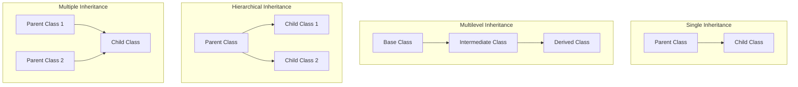

## Access Modifiers

Access modifiers are keywords in object-oriented programming (like Java, C++, C#) that define the visibility/scope of classes, methods, and variables.
They control who can access what in your code.

## Types of Access Modifiers

| Modifier   | Scope / Visibility                                | Example Use Case                          |
|------------|---------------------------------------------------|-------------------------------------------|
| **public** | Accessible from **anywhere** (inside or outside the class, package, project). | Methods like `main()` or utility functions. |
| **protected** | Accessible within the **same package** and by **subclasses** (even in different packages). | Useful for inheritance when child classes need parent’s methods/fields. |
| **default** (no keyword) | Accessible only within the **same package**. | Package-level helper classes. |
| **private** | Accessible only within the **same class**. | Encapsulation: hiding internal details of a class. |

```java
class Example {
    public int publicVar = 10;       // Accessible everywhere
    protected int protectedVar = 20; // Accessible in same package + subclasses
    int defaultVar = 30;             // Accessible only in same package
    private int privateVar = 40;     // Accessible only in this class

    // Public method
    public void showPublic() {
        System.out.println("Public Method");
    }

    // Private method
    private void showPrivate() {
        System.out.println("Private Method");
    }
}

class Test extends Example {
    void display() {
        System.out.println(publicVar);     // ✅ allowed
        System.out.println(protectedVar);  // ✅ allowed (subclass)
        // System.out.println(defaultVar); // ❌ not allowed if in different package
        // System.out.println(privateVar); // ❌ not allowed (private)
    }
}

```


## Encapsulation

Encapsulation is one of the four pillars of Object-Oriented Programming (OOP).
It means wrapping data (variables/fields) and methods (functions) together into a single unit (class), and controlling access to that data using access modifiers.

In simple words:
- Hide the internal details of how data is stored.
- Expose only necessary operations through methods (getters/setters).
- Prevent direct modification of fields from outside the class.

```java
    class Student {
    // Private fields (data hidden)
    private String name;
    private int age;

    // Public getter method (controlled access)
    public String getName() {
        return name;
    }

    // Public setter method (controlled access)
    public void setName(String name) {
        this.name = name;
    }

    // Getter for age
    public int getAge() {
        return age;
    }

    // Setter for age with validation
    public void setAge(int age) {
        if(age > 0) {
            this.age = age;
        } else {
            System.out.println("Age must be positive!");
        }
    }
}

public class EncapsulationExample {
    public static void main(String[] args) {
        Student s1 = new Student();

        // Accessing data via methods (not directly)
        s1.setName("Alice");
        s1.setAge(20);

        System.out.println("Name: " + s1.getName());
        System.out.println("Age: " + s1.getAge());

        // Trying invalid age
        s1.setAge(-5); // Will show validation message
    }
}

```

# 🎯 Summary

- Encapsulation = Data + Methods together in a class + Controlled access.
- It’s used for data hiding, security, maintainability, and flexibility.
- Achieved in Java by:
    - Making fields private.
    - Providing public getters and setters.


## Inheritance

Inheritance is an OOP concept where one class (child/derived class) can reuse the properties and methods of another class (parent/base class).

- It promotes code reusability and hierarchical relationships.
- The child class can also add new features or override existing ones from the parent.

```java
import java.util.*;
import java.util.*;

// Parent class or super class
class School {
    // Private attribute for school name
    private String schoolName;

    // Constructor initializes the school name
    School() {
        schoolName = "DPS"; // Default school name
    }

    // Method to print the school name
    void printSchoolName() {
        System.out.println("School name: " + schoolName);
    }
}

// Subclass or child class
class Student extends School {
    // Private attribute for student name
    private String studentName;

    // Constructor initializes the student name
    Student(String name) {
        this.studentName = name;
    }

    // Method to print the student name
    void printStudentName() {
        System.out.println("Student name: " + studentName);
    }
}

// Main class to execute the program
class Main {
    public static void main(String[] args) {
        // Create a new student object with the name "Raj"
        Student student = new Student("Raj");

        // Print the student's name
        student.printStudentName();

        // Print the school's name
        student.printSchoolName();
    }
}
```
 
## Types of Inheritance 



```java
// Base class (Parent)
class Vehicle {
    void start() {
        System.out.println("Vehicle starts with a key.");
    }
}

// Derived class (Single Inheritance)
class Car extends Vehicle {
    void drive() {
        System.out.println("Car drives on four wheels.");
    }
}

// Derived class from Car (Multilevel Inheritance)
class ElectricCar extends Car {
    void charge() {
        System.out.println("Electric car charges using electricity.");
    }
}

public class TestInheritance {
    public static void main(String[] args) {
        ElectricCar tesla = new ElectricCar();

        // Inherited from Vehicle
        tesla.start();

        // Inherited from Car
        tesla.drive();

        // Defined in ElectricCar
        tesla.charge();
    }
}
```
